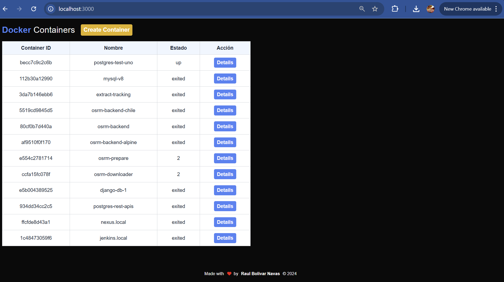
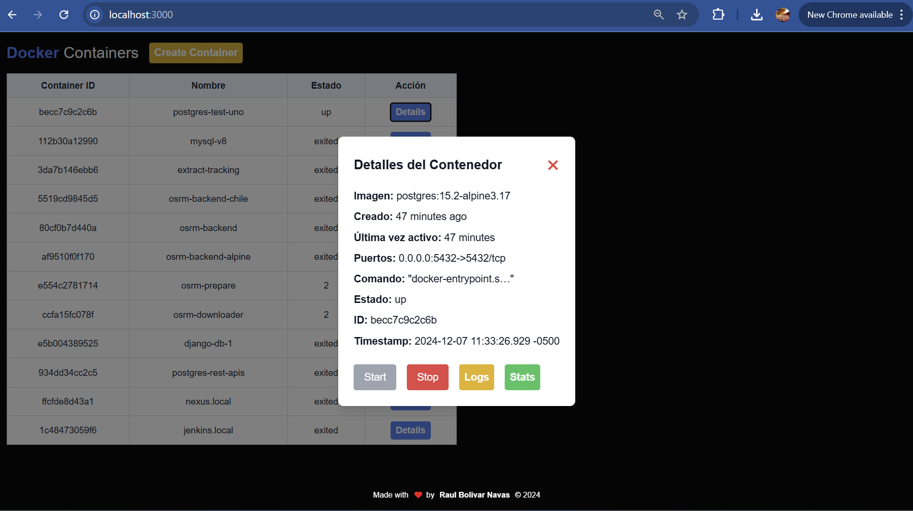
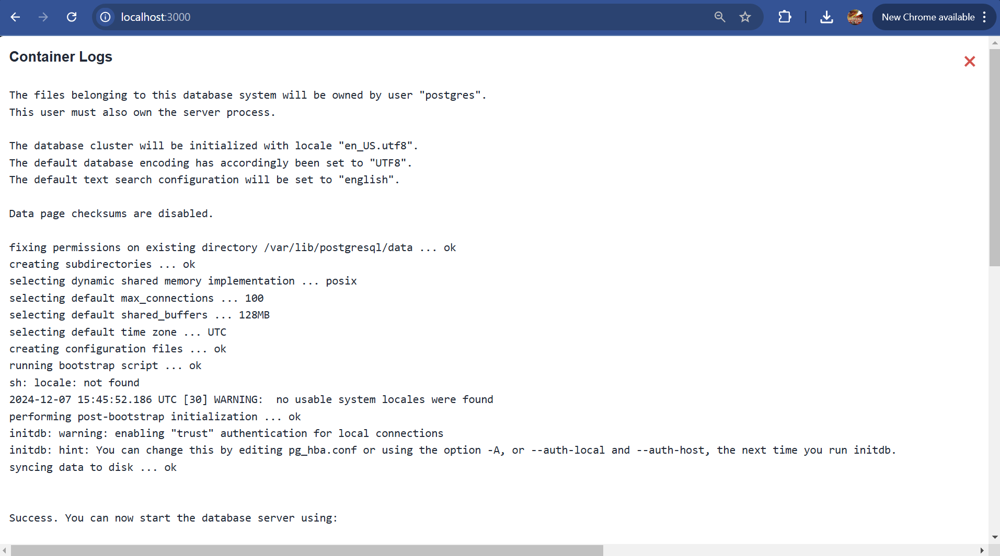
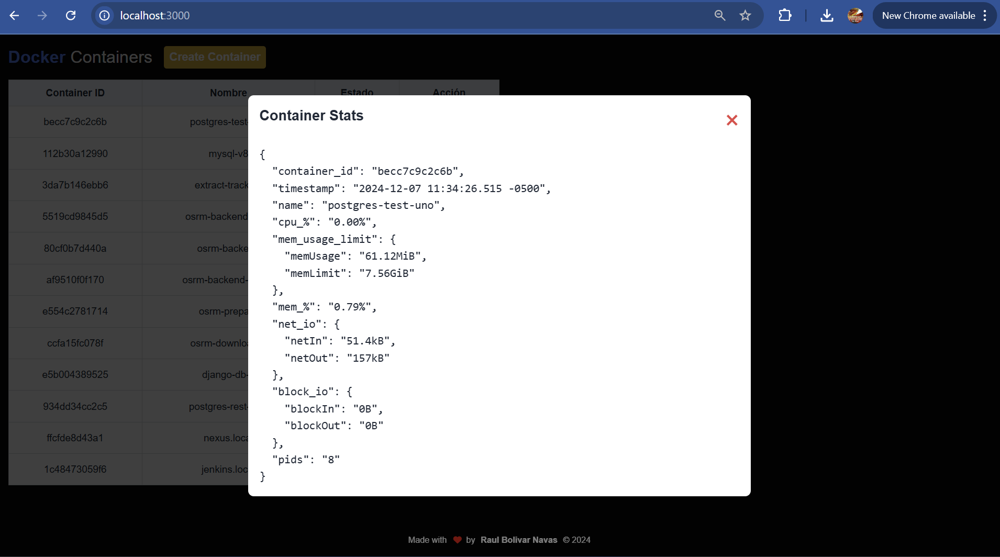

# Docker APP Tool

## Description

This tool is a simple application that allows you to manage your docker containers and images. It is a command line tool that allows you to perform the following operations:

- List all containers
- List all images
- Start a container
- Stop a container
- Remove a container
- Remove an image
- Create a container

## Preview

Dashboard

Details

Logs

Stats

## Installation

To install the tool, you can clone the repository and run the application.

## Author
Raul Bolivar Navas - 2024

## License
This project is licensed under the MIT License - see the LICENSE.md file for details.
